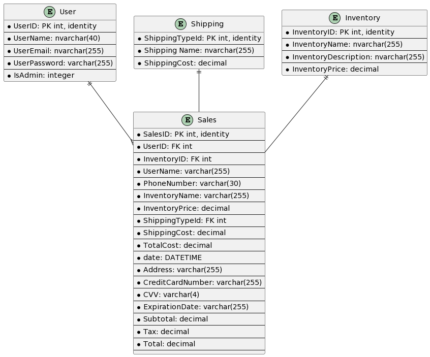

# Technology Selection
The following are languages and framework chosen by the developers to implement the LootX website:

[//]: # (Will research good reasons for selection)
## Languages
- ### C#:
    - Comprehensive Syntax: C# has concise syntax that helps save time with development
    - Available Online Documentation: C# has a lot of source code and documentation online which is helpful with dealing with 
  bugs and errors during implementation
    - Growing Community: Ranked #6 on trending programming languages in 2023, C# is a widely used language. 
  It's popularity will make expanding our team easier when looking for C# developers
    - High Scalability: The static coding nature of C# allows engineers to easily make adjustments and expand on
  any functionality within the developed/developing program

  #### Sources:
  - [BairesDev](https://www.bairesdev.com/technologies/c-sharp/)
  - [IEEE Spectrum](https://spectrum.ieee.org/the-top-programming-languages-2023) 

 

- ### HTML: 
  - Widely used build structure: HTML is a widely used Markup language for web development
  with a lot of troubleshooting information and experts readily available
  - Supported on all browsers: HTML can be supported by almost every single browser in the world,
  if not all
  - Simple Syntax: HTML has syntax that is easily comprehensible by many programmers and easy to learn
 and use
  - Integrates with other languages: HTML can also be integrated with other languages such as CSS, Javascript and
  C# as is being used in this project

  #### Source:
  - [GeeksforGeeks](https://www.geeksforgeeks.org/advantages-and-disadvanatges-of-html/)
  
 

- ### CSS
  - Easily used and paired with HTML: CSS has very simple syntax and enables developers to enhance user experience 
  by adding style to HTML components in a website
  - Faster page speed: CSS allows developers to add more features for less code through frameworks such as
  Bootstrap. Less code helps webpages load faster

  #### Source:
  - [DevMountain](https://devmountain.com/blog/what-is-css-and-why-use-it/)

 
 

## Frameworks
- ### ASP.NET Core (Model-View-Controller)
  - Set up Authentication System: ASP.NET has template pages such as user login and homepage setup and also a database which saves time with
  setting up
  - Fast and Efficient: Websites built with ASP.NET are relatively faster and more efficient than websites built with other frameworks
  such as PHP.
  - Compiles code to object code: This feature allows us to quickly resolve issues with our code
  - Compatible on all Computer OS: ASP.NET Core is newer and works across all major computer operating systems
  - High Level of Interactivity: ASP.NET Core are relatively more interactive but require more coding to make it 
  more responsive to users
  - Easy to Use Maintain: This framework provides features such as auto-scaling which helps add, adjust and expand our website as user
  demand changes

  #### Sources: 
  - [Indeed.com](https://www.indeed.com/career-advice/career-development/what-is-aspnet#:~:text=ASP.NET%20is%20beneficial%20in,faster%20execution%20than%20interpreted%20code.)
  - [ASP.NET Crash Course FreeCodeCamp](https://www.youtube.com/watch?v=BfEjDD8mWYg)

 

- ### Bootstrap
  - Pre-built components: Bootstrap offers a wide range of pre-build components such as buttons,
  forms, navigation bars, windows and more which saves coding time and effort, hence efficient
  - Customizable: Bootstrap does not only allow you to set up design with created templates but also allows
  developers to create templates and customize already existing components.
  - Open Source: Bootstrap is open source and free, saving cost with our UI design.

  #### Source:
  - [Clarity](https://www.clarity-ventures.com/blog/benefits-of-using-bootstrap-for-web-design)

 
 

# Database Storage Plan
- ### Overview
  This section outlines the Data Storage Plan for our Web Application, LootX. We are using 
    ASP.NET Core Framework together with an SQL Database to make this possible.

- ### Entities & Entity Table Diagram
    Our database will have four(4) entities namely:
  - _User_
  - _Inventory_
  - _Shipping_
  - _Sales_

[EntityDiagram](EntityDiagram.png)

[Field Descriptions](FieldDescritptions.md)

[Seed Data Table](DataSeedTable.md)
- ### Storage Initialization and Procedure
Instead of manually making tables and connecting them to our classes, we are using ORM(Object Relational Mapper) to connect our database to our classes.

- ### References
  - [ASP.NET MVC Documentation](https://jakeydocs.readthedocs.io/en/latest/mvc/)
  - [ASP.Net Working with Data Documentation](https://learn.microsoft.com/en-us/aspnet/web-pages/overview/data/5-working-with-data)
 
   

# Coding Style Guide
  - For our LootX project, our team will be utilizing rules from the [<strong><i>Microsoft C# Style</i></strong>](https://learn.microsoft.com/en-us/dotnet/fundamentals/code-analysis/style-rules/) Guide together with some custom rules of ours. The Microsoft C# Style is divided into:
    - C# Identifier Naming Rules and Conventions
    - C# Coding Conventions

    - ### Naming Rules
      Valid identifiers must follow these rules:

      - Identifiers must start with a letter or underscore (_).
      - Identifiers may contain Unicode letter characters, decimal digit characters, Unicode connecting characters, Unicode combining characters, 
      or Unicode formatting characters. For more information on Unicode categories, see the Unicode Category Database.
    
      You can declare identifiers that match C# keywords by using the "@" prefix on the identifier. 
    The "@" isn't part of the identifier name. For example, "@if" declares an identifier named if. These verbatim identifiers are primarily for interoperability with identifiers declared in other languages.

    For a complete definition of valid identifiers, see the [Identifiers article in the C# Language Specification](https://learn.microsoft.com/en-us/dotnet/csharp/language-reference/language-specification/lexical-structure#643-identifiers).

 

  - ### Naming Conventions
    - Type names, namespaces, and all public members should be named using PascalCase
    - Interface name should be start with a capital I.
    - Attribute types end with the word "Attribute".
    - Use meaningful and descriptive names for naming variables, classes and methods.
    - Do not use a single character to name variables unless initialized in a loop counter
    such as a for loop (e.g. "(for int "<i>(for int i = 0;...)</i>")
    - Clarity over Brevity. Comments should be clear and precise as possible.
    - Use one or two break tags "<br\>" to separate sections where documenting occurs.
    - Leave an empty line or two before <strong>AND</strong> after comments, methods, classes or objects 
      made in the same file.

 

  - ### Coding Conventions
    Language Guidelines
    - The following sections describe practices that the .NET docs team follows to prepare code examples and samples. In general, follow these practices:
    - Utilize modern language features and C# versions whenever possible.
    - Avoid obsolete or outdated language constructs.
    - Only catch exceptions that can be properly handled; avoid catching generic exceptions.
    - Use specific exception types to provide meaningful error messages.
    - Use LINQ queries and methods for collection manipulation to improve code readability.
    - Use asynchronous programming with async and await for I/O-bound operations.
    - Be cautious of deadlocks and use Task.ConfigureAwait when appropriate.
    - Use the language keywords for data types instead of the runtime types. For example, use string instead of System.String, or int instead of System.Int32.
    - Use int rather than unsigned types. The use of int is common throughout C#, and it's easier to interact with other libraries when you use int. Exceptions are for documentation specific to unsigned data types.
    - Use var only when a reader can infer the type from the expression. Readers view our samples on the docs platform. They don't have hover or tool tips that display the type of variables.
    - Write code with clarity and simplicity in mind.
    - Avoid overly complex and convoluted code logic.

  #### Sources:
  - [Codacy](https://blog.codacy.com/3-popular-csharp-style-guides)
  - [Microsoft C# Style Guide](https://learn.microsoft.com/en-us/dotnet/csharp/fundamentals/coding-style/identifier-names#naming-rules)
